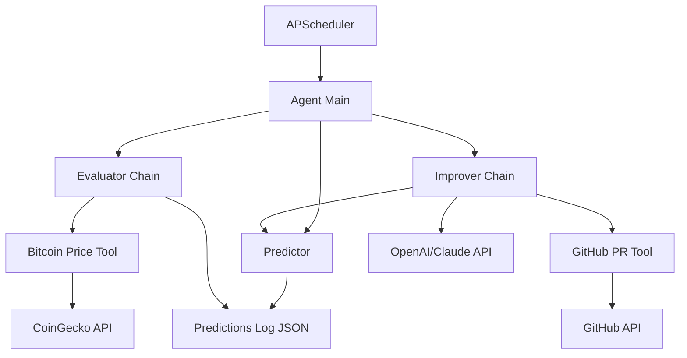

# System Patterns: Autonomous Agent Architecture

## 🏗️ Core Architecture

### Component Relationships



### Data Flow Pattern

1. **Prediction Flow**: `agent_main.py` → `predictor.py` → `predictions_log.json`
2. **Evaluation Flow**: `evaluator.py` → `bitcoin_price.py` → `predictions_log.json` (update)
3. **Improvement Flow**: `improver.py` → `predictor.py` (new version) → `github_pr.py`
4. **Scheduling Flow**: `APScheduler` → triggers evaluation every 24h

## 🔧 Design Patterns

### Agent Orchestration Pattern (LangChain)

```python
# Core agent structure
class AutonomousAgent:
    def __init__(self):
        self.evaluator_chain = EvaluatorChain()
        self.improver_chain = ImproverChain()
        self.tools = [BitcoinPriceTool(), GitHubPRTool()]
    
    def run_cycle(self):
        # 1. Make prediction
        # 2. Schedule evaluation  
        # 3. Improve if failed
        # 4. Create PR if improved
```

### LangChain Chain Patterns

#### Evaluator Chain
- **Input**: Prediction record + current Bitcoin price
- **Process**: Compare prediction vs actual outcome
- **Output**: Updated prediction record with success/failure
- **Tools**: Bitcoin price fetcher

#### Improver Chain  
- **Input**: Failed prediction + current predictor code
- **Process**: LLM analyzes failure and generates improved code
- **Output**: New predictor.py code + improvement rationale
- **Tools**: Code reader, GitHub PR creator

### Code Improvement Pattern

```python
# Structured improvement prompt
IMPROVEMENT_PROMPT = """
You are a Bitcoin prediction expert. This prediction failed:

Input: "{news_summary}"
Prediction: "{predicted_direction}" 
Actual Bitcoin price: {actual_direction} ({actual_change}%)

Current prediction logic:
```python
{current_code}
```

Analysis: {failure_analysis}

Generate improved prediction logic that handles this scenario.
Only return the new predict() function code.
"""
```

## 📁 Project Structure Pattern

### Minimal MVP Structure
```
bitcoin-predictor/
├── agent_main.py              # Main orchestrator
├── predictor.py              # Core prediction logic  
├── predictions_log.json     # Simple JSON persistence
├── config.py                # Configuration management
├── requirements.txt
├── .env.example
├── README.md
├── tools/                   # External API integrations
│   ├── __init__.py
│   ├── bitcoin_price.py     # CoinGecko integration
│   └── github_pr.py         # GitHub API integration
└── chains/                  # LangChain components
    ├── __init__.py
    ├── evaluator.py         # Evaluation logic
    └── improver.py          # Code improvement logic
```

### File Responsibility Pattern

- **agent_main.py**: Entry point, scheduling, error handling
- **predictor.py**: Contains single `predict(summary: str) -> str` function
- **predictions_log.json**: Append-only prediction records
- **tools/*.py**: Stateless API wrappers
- **chains/*.py**: LangChain chain definitions

## 🔄 Autonomous Loop Pattern

### Main Agent Loop
```python
def autonomous_loop():
    while True:
        try:
            # 1. Make prediction if needed
            if should_make_prediction():
                make_prediction()
            
            # 2. Evaluate pending predictions
            evaluate_predictions()
            
            # 3. Improve if failures detected
            failed_predictions = get_recent_failures()
            if failed_predictions:
                improve_predictor(failed_predictions)
            
            # 4. Sleep until next cycle
            sleep_until_next_evaluation()
            
        except Exception as e:
            log_error_and_continue(e)
```

### GitHub PR Pattern
```python
# PR creation pattern
def create_improvement_pr(old_code, new_code, analysis):
    pr_body = f"""
    ## 🤖 Autonomous Agent Code Improvement
    
    **Failed Prediction Analysis:**
    {analysis}
    
    **Code Changes:**
    - Improved handling of {specific_scenario}
    - Added logic for {new_pattern}
    
    **Expected Improvement:**
    {improvement_rationale}
    """
    
    create_pr(
        title="🤖 Auto-improve Bitcoin predictor",
        body=pr_body,
        files={"predictor.py": new_code}
    )
```

## 🛡️ Safety & Error Handling Patterns

### Code Validation Pattern
```python
def validate_generated_code(code):
    # 1. Syntax check
    compile(code, '<string>', 'exec')
    
    # 2. Function signature check
    assert 'def predict(summary: str) -> str:' in code
    
    # 3. Safe execution test
    test_prediction = execute_safely(code, "Fed raises rates")
    assert test_prediction in ['up', 'down']
```

### Graceful Failure Pattern
- **API Failures**: Retry with exponential backoff
- **Code Generation Failures**: Log and continue with current logic
- **GitHub Failures**: Queue PR for later retry
- **Evaluation Failures**: Mark as inconclusive, don't trigger improvement

## 📊 Data Persistence Patterns

### Simple JSON Schema
```json
{
    "predictions": [
        {
            "id": "uuid",
            "timestamp": "2024-01-01T12:00:00Z",
            "input_summary": "Fed announces rate cut",
            "predicted_direction": "up",
            "actual_price_before": 45000.0,
            "actual_price_after": 47000.0,
            "actual_direction": "up",
            "success": true,
            "evaluation_timestamp": "2024-01-02T12:00:00Z"
        }
    ]
}
```

### Append-Only Pattern
- Never modify existing prediction records
- Always append new evaluations
- Maintain chronological order
- Simple file locking for concurrent access

## 🎯 Integration Patterns

### API Integration Pattern
- **Thin wrapper classes** for each external API
- **Retry logic** built into each tool
- **Rate limiting** respect for APIs
- **Error handling** that doesn't break main loop

### LangChain Tool Pattern
```python
class BitcoinPriceTool(BaseTool):
    name = "bitcoin_price"
    description = "Fetch current Bitcoin price from CoinGecko"
    
    def _run(self, query: str) -> str:
        # Implementation with error handling
        pass
``` 