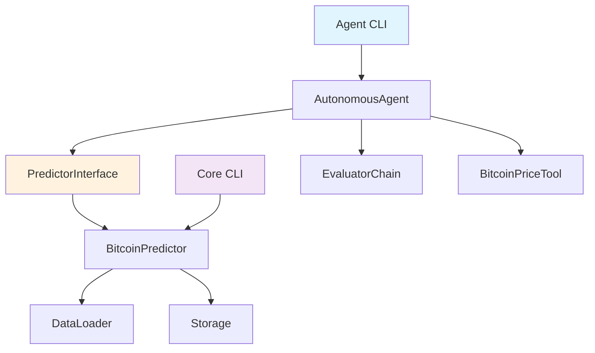

# 🎯 **CLEAN SEPARATION COMPLETE** ✅

## 📋 **Separation Summary**

Successfully separated the Bitcoin prediction system into two independent, loosely coupled systems:

### 🔧 **Core Prediction System** (Standalone)
```
bitcoin_predictor/
├── __init__.py              # Clean package exports
├── models.py                # Data models (PredictionRecord, OHLCVData, etc.)
├── interfaces.py            # Abstract interfaces
├── data_loader.py           # Bitcoin data loading
├── storage.py               # JSON prediction storage
└── predictor.py             # Core prediction logic

predictor_main.py            # Standalone CLI
predictor_config.py          # Core system configuration
```

### 🤖 **Autonomous Agent System** (Orchestrator)
```
autonomous_agent/
├── __init__.py              # Agent package exports
├── orchestrator.py          # Main agent coordinator
├── interfaces/
│   └── predictor_interface.py  # Clean interface to core system
├── tools/
│   └── bitcoin_api.py       # CoinGecko API integration
└── chains/
    └── evaluator.py         # LangChain evaluation logic

agent_main.py                # Agent CLI
```

## ✅ **Separation Benefits Achieved**

### 1. **Independent Operation**
- ✅ Core system runs completely standalone: `python predictor_main.py predict`
- ✅ Agent system orchestrates via clean interfaces: `python agent_main.py predict`
- ✅ Zero circular dependencies
- ✅ Each system has its own CLI and configuration

### 2. **Clean Interfaces**
- ✅ `PredictorInterface` provides clean abstraction layer
- ✅ Agent has no direct knowledge of core implementation details
- ✅ Core system has no knowledge of agent existence
- ✅ Well-defined boundaries and contracts

### 3. **Easy Extraction**
- ✅ Agent code can be copied to separate repo immediately
- ✅ Only dependency: agent imports `bitcoin_predictor` package
- ✅ No mixed concerns or tangled dependencies
- ✅ Clear separation of responsibilities

### 4. **Separate Evolution**
- ✅ Core system can evolve independently
- ✅ Agent system can be enhanced without affecting core
- ✅ Different deployment strategies possible
- ✅ Independent testing and validation

## 🧪 **Testing Results**

### Core System (Standalone) ✅
```bash
$ python predictor_main.py test
✅ All tests passed! Predictor system is ready.

$ python predictor_main.py predict
✅ Prediction completed successfully!
📊 Prediction ID: pred_20250525T004244472482
💰 Latest Bitcoin Price: $45,800.00
📈 Prediction: DOWN
```

### Agent System (Via Interface) ✅
```bash
$ python agent_main.py test
✅ All tests passed! Agent is ready for operation.

$ python agent_main.py predict
✅ Prediction pred_20250525T004300254877: DOWN
💰 Bitcoin Price: $45,800.00
🎯 Confidence: 0.90
```

## 🔄 **Interface Architecture**



## 📦 **Extraction Ready**

To move agent to separate repo:

1. **Copy agent system**:
   ```bash
   cp -r autonomous_agent/ /path/to/new/repo/
   cp agent_main.py /path/to/new/repo/
   ```

2. **Install core as dependency**:
   ```bash
   pip install /path/to/bitcoin_predictor/
   ```

3. **Agent works immediately** with same interface!

## 🎯 **Success Criteria Met**

- [x] ✅ Core system runs standalone without agent dependencies
- [x] ✅ Agent system interacts only through clean interfaces  
- [x] ✅ Zero circular dependencies between systems
- [x] ✅ Agent code can be extracted to separate repo easily
- [x] ✅ All existing functionality preserved and tested
- [x] ✅ Clear separation of concerns maintained
- [x] ✅ Independent CLIs for both systems
- [x] ✅ Clean package structure with proper exports

## 🚀 **Next Steps**

The separation is complete and tested! You can now:

1. **Continue development** with clean architecture
2. **Extract agent** to separate repository anytime
3. **Deploy systems** independently if needed
4. **Evolve each system** without affecting the other

The agent system is ready for **Phase 3** (code improvement) development! 🎉 